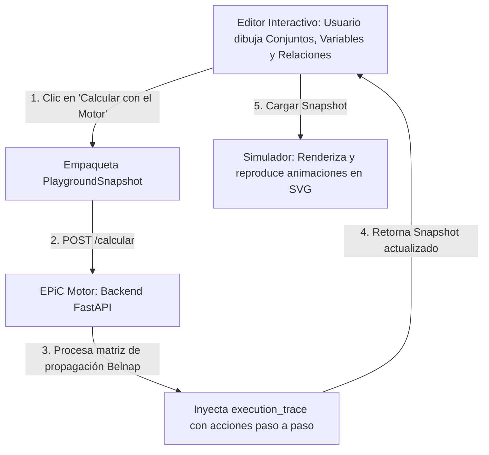

# EPiC Playground - Simulador y Editor Interactivo

Este directorio contiene la interfaz web visual (Frontend) de **EPiC Playground**. Está diseñado con un enfoque moderno y dinámico para que los usuarios puedan interactuar con la lógica de Belnap de cuatro valores ($V, F, N, B$), dibujar conjuntos, variables y relaciones de implicación, y visualizar paso a paso la propagación calculada por el motor.

---

## 📐 Arquitectura y Flujo de Datos

El diseño de esta rama separa estrictamente la **lógica matemática** de las **coordenadas visuales**, permitiendo que una misma variable lógica (ej. `p`) esté dibujada en múltiples cajas o sets a la vez y actúe de forma sincronizada.



### Componentes Clave:
1. **EPiC Motor (`epic_motor/`)**: Backend en Python (FastAPI) que calcula la inferencia lógica.
2. **EPiC Simulador (`epic_simulador/`)**: SPA interactiva (Vite + HTML/CSS/JS vanila) con soporte para:
   * **Vista de Cajitas (Pares)**: Muestra conjuntos agrupados en pares consecutivos de implicación.
   * **Vista Global**: Un lienzo interactivo con zoom, paneo y distribución automática del grafo.
   * **Editor Interactivo (Sandbox)**: Espacio de dibujo para crear y probar escenarios desde el navegador.

---

## 🛠️ Requisitos previos

Asegúrate de tener instalado en tu máquina:
* **Node.js** (versión 18 o superior)
* **Python** (versión 3.10 o superior)
* **Gestores de paquetes**: `npm` (incluido con Node) y `pip` (incluido con Python)

---

## 🚀 Guía de Instalación y Despliegue Local

Para levantar todo el sistema de manera local, abre tu terminal y sigue los siguientes pasos:

### 1. Configurar y encender el Backend (EPiC Motor)

Navega a la carpeta del motor, instala las dependencias necesarias y arranca el servidor FastAPI:

```bash
# 1. Entrar a la carpeta del motor
cd epic_motor

# 2. Instalar dependencias de Python
pip install -r requirements.txt

# 3. Iniciar el servidor local en el puerto 8000
python -m uvicorn main:app --reload --port 8000
```
> [!IMPORTANT]
> El motor debe quedar corriendo en `http://localhost:8000`. No cierres esta ventana de la terminal.

---

### 2. Configurar y encender el Frontend (EPiC Simulador)

En una **nueva pestaña o ventana de la terminal**, navega a la carpeta del simulador y enciende el servidor de desarrollo de Vite:

```bash
# 1. Entrar a la carpeta del simulador
cd epic_simulador

# 2. Instalar las dependencias de Node
npm install

# 3. Arrancar el servidor de desarrollo local
npm run dev
```

Una vez que termine de compilar (en menos de 100 ms), la terminal te indicará la URL local:
👉 **`http://localhost:5173/`**

Ábrela en tu navegador para ver la interfaz interactiva.

---

## 🎨 Cómo funciona la Simulación, Interactividad y Animación

### 1. Interactividad Directa en el Lienzo Global
En la pestaña **"Vista Global (Lienzo)"**, tienes el poder de construir escenarios completos de forma visual y responsiva:
* **Creación Rápida (+):** Botón verde para crear Conjuntos o Variables en tiempo real. **[NUEVO]** Al crear una nueva variable, el sistema te solicitará ingresar su valor de verdad de Belnap explícito (V, F, N, B) para un control más estricto del estado inicial.
* **Operaciones (🔗):** Botón azul para establecer Relaciones lógicas (ej. IMPLIES, AND) especificando orígenes y destinos de las variables.
* **Eliminación Intuitiva (-):** Botón rojo o simplemente **Doble-Clic** sobre cualquier variable o conjunto para eliminarlo instantáneamente.
* **Arrastrar y Soltar (Drag & Drop):** Las variables y conjuntos se pueden mover por todo el lienzo manteniendo su cohesión. Las flechas (relaciones) recalcularán automáticamente su curvatura y posición para no perder la conexión lógica.
* **Espacios Dinámicos y Fluidos:** **[NUEVO]** La interfaz ahora responde dinámicamente al tamaño y cantidad de elementos del lienzo. La restricción fija de pantalla ha sido eliminada permitiendo que el lienzo y la vista de cajitas se expandan infinitamente, activando el scroll nativo de forma limpia y accesible.
* **Auto-Sincronización y Doble JSON:** Cada acción ejecutada en el lienzo se envía al **Motor de Python de forma invisible y automática**. **[NUEVO]** El backend ahora genera una traza estricta paso-a-paso (`paso += 1` por mutación individual), garantizando que las animaciones subsecuentes nunca colisionen y respeten el Execution Trace íntegro. Además, un panel de control con doble vista muestra el **JSON Enviado** (petición en crudo) y el **JSON Recibido** (con el trace).

### 2. Ejemplos Rápidos y Deducción Natural
A través del botón **"Explorar Ejemplos"**, puedes cargar al instante presets complejos ya modelados en el lienzo. 

> **⭐ IMPORTANTE - DEDUCCIÓN NATURAL:** Se ha incluido específicamente el preset **"Deducción Natural"**. Este modelo recrea de forma exacta el escenario metodológico y caso de uso investigativo que se pidió derivado del artículo. Contiene las configuraciones necesarias de las variables para aplicar en tiempo real las reglas de **Modus Tollens (MT)**, **Introducción a la Conjunción (∧I)**, **Eliminación de Conjunción (∧E)** y **Eliminación de Negación (¬E)** en base a la lógica de Belnap. Es la demostración cúspide del motor.

### 3. Animación Inteligente de Partículas
Cuando el simulador recibe la traza del motor (`execution_trace`), crea una línea de tiempo paso a paso:
* **Valores Positivos (`V`)**: Viajan en dirección de la flecha (hacia adelante). Se representan con partículas verdes.
* **Valores Negativos (`F`)**: Viajan en dirección contraria a la flecha (hacia atrás / contrapositiva). Se representan con partículas rojas.
* **Visibilidad Dinámica (History-Aware)**: Las variables de destino con valor inicial `N` (neutras) comienzan invisibles en el paso 0. La bolita de verdad correspondiente aparecerá mágicamente en su circunferencia de destino una vez que la animación de la partícula complete su recorrido.

### 4. Controles de Reproducción
En la barra de herramientas superior tienes control absoluto de la simulación:
* **Play / Pause**: Reproduce o pausa la animación cronometrada.
* **Step Forward (Siguiente paso) / Step Backward (Paso anterior)**: Permite depurar la propagación cuadro por cuadro manualmente.
* **Velocidad (Slider)**: Cambia dinámicamente el tiempo de transición (entre 300ms y 2500ms).

---

## 📝 Guía de Integración para el Equipo de EDITOR

> [!WARNING]
> **El "Editor Interactivo" del Simulador es un Sandbox Temporal.**
> Esta pestaña fue construida únicamente como una herramienta de depuración y pruebas E2E para el equipo de simulación. **No reemplaza el trabajo del equipo de Editor.** El desarrollo final de la interfaz de dibujo y el modelado del lienzo sigue siendo responsabilidad exclusiva del equipo de Editor.

Para que el Editor definitivo funcione en armonía con nuestro Simulador, el equipo de Editor debe implementar los siguientes puntos de integración:

### 1. Responsabilidades del Editor
1. **Modelar el Grafo**: Proveer la interfaz para crear Conjuntos, Variables y Relaciones.
2. **Generar Coordenadas Visuales**: Posicionar cada elemento en un espacio bidimensional ($x, y$), asignándoles un ID único de instancia visual en `visual.instances` y enlazándolo con su ID lógico en `logic.variables` (esto soporta que una variable tenga múltiples representaciones visuales).
3. **Validar antes de Enviar**: Utilizar el validador de integridad referencial para evitar elementos fantasma antes del cálculo.

### 2. Contrato de Comunicación y Flujo HTTP
El Editor debe encargarse de la orquestación del cálculo contra el Motor. Los pasos técnicos son:

1. **Construir el Snapshot inicial**: Empaquetar el lienzo en el formato JSON `PlaygroundSnapshot` definido en `domain/editorTypes.ts`.
2. **Consumir el Motor**: Realizar una petición `POST` al endpoint `/calcular` de la API de Python (`http://localhost:8000/calcular`) enviando el JSON del Snapshot.
3. **Capturar la Respuesta con la Traza**: El Motor responderá con el mismo Snapshot, habiendo inyectado el nodo `execution_trace`.
4. **Enviar al Simulador**: Transferir el JSON final (con el trace completo) al simulador para que este reproduzca la animación visual.

### 3. Métodos para pasar Datos al Simulador
El Editor puede transferir el JSON al Simulador mediante dos vías principales:
* **Vía Carga de Archivos (Desacoplado)**: El Editor ofrece un botón para "Exportar Snapshot JSON" y el usuario lo carga o arrastra en la zona de drop de la barra lateral del Simulador.
* **Vía Importación de Módulo (Acoplado)**: Si se integran ambos proyectos en una misma SPA, el Editor puede importar y llamar directamente a la función global del simulador:
  ```javascript
  import { loadSnapshot } from './simulator.js';

  // Al recibir el JSON del motor con el trace
  loadSnapshot(finalSnapshotJSON);
  ```

---

## 📂 Estructura del Simulador (`epic_simulador/`)

* **`index.html`**: Estructura principal y layout de pestañas de la aplicación.
* **`style.css`**: Sistema de diseño moderno. Contiene variables HSL para el modo oscuro, estilo glassmorphism y las animaciones/keyframes de flujo CSS.
* **`simulator.js`**: El motor del simulador gráfico. Administra el estado de la reproducción, dibuja los elementos SVG y gestiona la comunicación HTTP con el microservicio del motor lógico.
* **`e2e-real-trace.json`**: Un archivo JSON de ejemplo de prueba que puedes arrastrar o copiar para ver un flujo complejo en acción de inmediato.

---

## ⚡ Comandos Útiles en `epic_simulador`

* `npm run dev`: Arranca el servidor local de desarrollo.
* `npm run build`: Empaqueta y optimiza los archivos para producción dentro de la carpeta `dist/`.
* `npm run preview`: Previsualiza localmente el build de producción generado.
